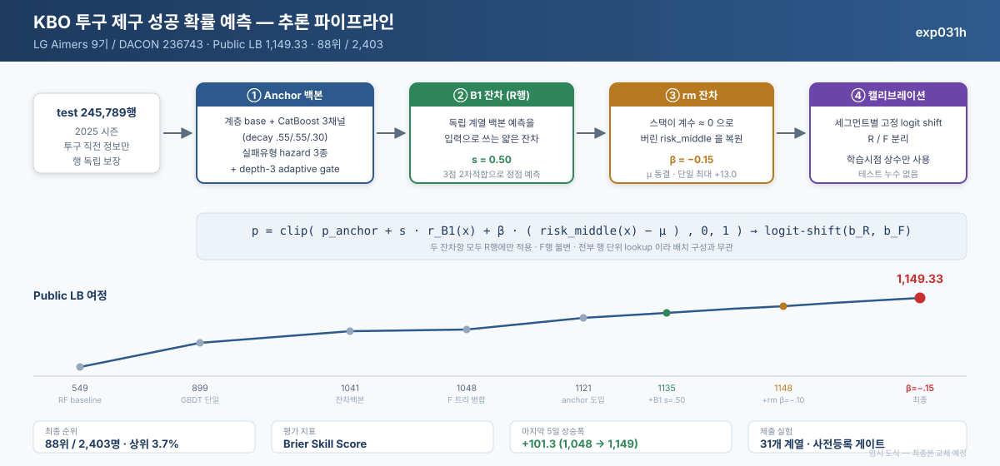

# KBO 투구 제구 성공 확률 예측

**LG Aimers 9기 | [DACON 236743](https://dacon.io/competitions/official/236743/overview/description)**

**리더보드 88위, 점수 1,149.33143.** 대회 페이지에 표시된 전체 참가자는 **2,403명**이다.
리더보드 순위는 팀 단위이고 참가자 수는 개인 단위이므로, 두 수치로 상위 백분위를 계산하지 않는다.



야구 투수가 공을 던지기 **직전**의 정보(볼카운트, 주자, 타자/투수 특성, 과거 투구 기록)만 보고,
그 공이 **제구에 성공할 확률**을 맞히는 과제다.
2019–2024년 147만 개의 투구로 학습해서, **처음 보는 2025년 시즌 24.6만 개**를 예측한다.

---

## 한눈에 보기

| | |
|---|---|
| **무엇을** | 투구별 제구 성공 확률 (0~1) 예측 |
| **평가** | Brier Skill Score — 확률이 얼마나 *정확하게 맞는지*를 봄 |
| **최종 구성** | anchor 백본 위에 **얇은 잔차 2층 + 캘리브레이션**을 쌓음 |
| **추론 제한** | 제출 환경에서 10분 이내 |

---

## 핵심 아이디어

### 1. 이 대회는 "평균을 어디에 두느냐" 싸움이다

평가 지표는 모든 투구에 똑같은 평균값을 찍으면 **정확히 0점**이 되도록 설계되어 있다.
그리고 지표 식에 2025년 성공률(약 0.475)을 넣어 보면 **LB 100점 차이가 Brier 오차 0.00025 차이**에 불과하다.

즉 신호가 매우 얇아서, 모델을 바꾸는 것보다 **예측 평균을 2025년에 맞게 옮기는 것**이 점수를 먼저 좌우한다.
그래서 파이프라인의 마지막 단계는 항상 **세그먼트별 고정 보정**이다.

### 2. 계수는 리더보드 곡선으로 정했다

잔차층의 강도를 로컬 검증만으로 정하지 않고, **리더보드 점수 3개를 찍어 2차 곡선을 그린 뒤 꼭짓점을 예측**했다.

```
B1 강도 s   :  .15 → 1131.25   .35 → 1134.54   →  예측 ".50에서 1135.1"  →  실측 1135.11 ✅
rm 계수 β   :   0  → 1135.11  −.10 → 1148.13   →  예측 "|β|≈0.14가 정점"  →  −.15에서 1149.33 ✅
```

두 번 다 예측이 적중했고, 그 뒤로 더 밀어본 제출은 모두 점수가 떨어져 **정점 도달**을 확인했다.

### 3. 가장 큰 개선은 "모델이 버린 부품"에서 나왔다

anchor 모델은 내부에서 실패 유형(가운데로 몰림 / 크게 빠짐 / 역방향)을 예측하는 부품 3개를 쓰는데,
최종 결합 단계에서 이 부품들의 가중치가 **거의 0**이었다. 모델이 "쓸모없다"고 판단한 것이다.

그중 *가운데로 몰릴 위험*(`risk_middle`) 하나를 따로 꺼내 되먹이자 **+13점**, 단일 개선 중 최대였다.

> ⚠️ 정직하게 적자면, 이 개선은 **우리 로컬 검증에서는 통과하지 못했다**(정직한 검증에서 −15.7).
> 그럼에도 리더보드로 확인해서 채택했다. 자세한 경위는 [`docs/experiment-log.md` §4](docs/experiment-log.md) 참고.

---

## 추론 파이프라인

그림의 번호와 대응한다.

| 단계 | 하는 일 |
|---|---|
| **① Anchor** | 투수, 타자 이력 기반 base + CatBoost 3개 + 실패유형 예측 3개 → 결합 → 적응형 gate |
| **② B1 잔차** | 다른 계열 모델의 예측을 입력으로 받는 얇은 보정층. 강도 `s = 0.50` |
| **③ rm 잔차** | anchor가 버린 `risk_middle`을 되먹임. 계수 `β = −0.15` |
| **④ 캘리브레이션** | 정규시즌(R) / 기타(F) 별로 확률을 한 번에 이동 |

②③은 정규시즌(R) 투구에만 적용한다. 모든 단계가 **투구 한 개씩 독립적으로** 계산되어, 다른 투구 정보를 전혀 참조하지 않는다.

```
p = clip( p_anchor + s * r_B1(x) + β * (risk_middle(x) − μ),  0, 1 )   →   세그먼트별 logit 이동
```

---

## 점수 변화

| 단계 | Public LB |
|---|---|
| 공식 baseline (RandomForest) | 549.51 |
| 단일 GBDT | 898.71 |
| 자체 잔차 백본 + F 전용 트리 | 1,048.03 |
| 3채널 CatBoost anchor 도입 | 1,120.60 |
| + ② B1 잔차 | 1,135.11 |
| **+ ③ rm 잔차** | **1,149.33** 🏆 |

전체 제출 이력(25건)과 기각한 실험은 [`docs/experiment-log.md`](docs/experiment-log.md)에 있다.

---

## 학습과 검증

**시간 순 검증** — 미래 시즌을 맞히는 과제라, 항상 "그 이전 시즌으로만 학습 → 다음 시즌 예측"으로 검증했다.
무작위로 섞어 나누면 미래 정보가 새어 들어가 점수가 부풀려진다.

**사전등록** — 실험마다 통과 기준을 **실행 전에 파일로 고정**했다. 결과를 본 뒤 기준을 바꾸지 않는다.
이 덕분에 여러 실험을 제출 없이 기각해 하루 5회뿐인 제출 기회를 아꼈다.

**배운 점** — 로컬 점수가 하루에 다섯 번 뒤집힌 적이 있는데, 모델이 바뀐 게 아니라 **숫자를 잘못 읽은 것**이었다.
이 경험을 정리한 문서가 이 프로젝트에서 가장 재사용 가치가 높다 → [`docs/validation-playbook.md`](docs/validation-playbook.md)

### 시도했지만 안 된 것

| 시도 | 결과 |
|---|---|
| 신경망 (임베딩 NN, 멀티태스크 NN, TabM) | 신호가 너무 얇아 3~8 epoch 만에 과적합. 기존 모델과 섞어도 이득 없음 |
| 신규 투수 전용 보정 | 신규 투수가 오히려 가장 잘 맞추는 그룹이었음 |
| 시즌 진행도 피처 | 누적 기록 대비 추가 정보 없음 |

---

## 저장소 구조

```
.
├── README.md
├── assets/
│   └── pipeline.svg              # 파이프라인 도식 (임시)
├── docs/
│   ├── methodology.md            # 단계별 상세 설계와 상수
│   ├── experiment-log.md         # 제출 25건 + 기각 실험 전체 이력
│   └── validation-playbook.md    # 로컬 지표에 속지 않는 법
└── src/
    └── metric.py                 # 대회 평가 지표 구현
```

이 저장소는 **결과와 방법을 보여주기 위한 쇼케이스**다.
대회 데이터, 최종 학습 가중치와 전체 학습 및 추론 파이프라인은 포함하지 않는다.
공개 코드는 [`src/metric.py`](src/metric.py)의 평가 지표 구현이며, 방법과 실험 이력은 `docs/`에서 확인할 수 있다.

---


## 환경

| 항목 | 값 |
|---|---|
| 학습 | NVIDIA A100 40GB |
| 주요 라이브러리 | CatBoost 1.2.10, LightGBM 4.7.0, scikit-learn 1.9.0, PyTorch 2.11 |
| 제출 환경 | 오프라인 L4 22.4GB / 6 vCPU / 28GB, 추론 10분 이내 |
